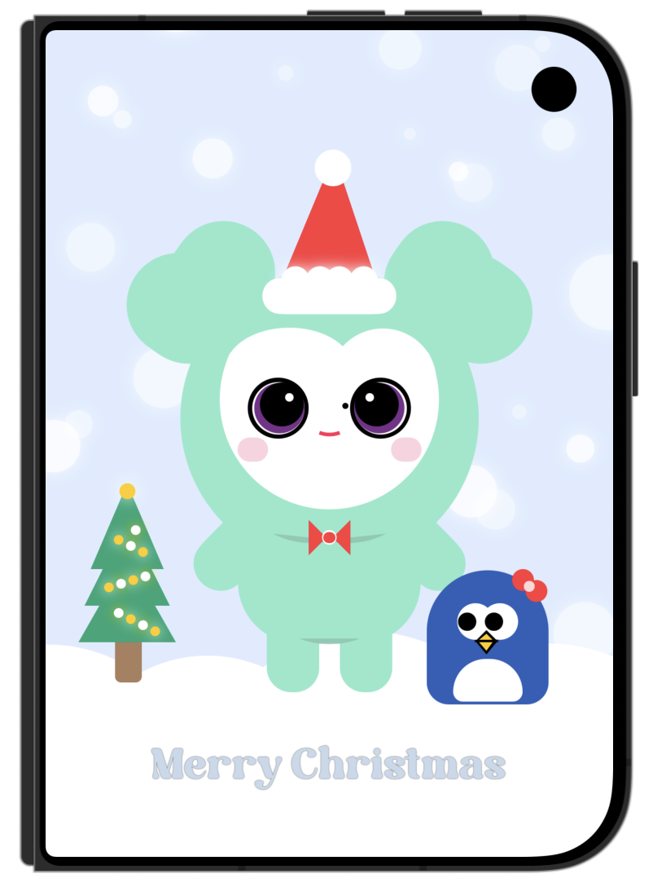

<div align="center">

# 🎄 Merry Christmas with Mively & Miguin ❄️

<p align="center">
  <b>A Pure SwiftUI Vector Illustration featuring TWICE's Lovelys Mascots</b><br>
  純 SwiftUI 原生圖形刻劃的聖誕主題插畫 ‧ 零外部圖片載入
</p>

<!-- Badges -->
[](https://swift.org)
[](https://developer.apple.com/xcode/swiftui/)
[](https://developer.apple.com/ios/)
[](https://developer.apple.com/xcode/)
[](#-implementation-details)

<br/>

<!-- Language Switcher Anchor -->
<p align="center">
  🌐 <b>Language / 語言切換</b><br/>
  <a href="#-english-version"><b>English</b></a> • <a href="#-繁體中文版本"><b>繁體中文</b></a>
</p>

---

<!-- App Screenshot -->
<a href="screenshots/screenshot.png">
  
</a>

<br/>
<sub>✨ 100% Handcrafted pure SwiftUI code art — Every pixel is composed of native SwiftUI shapes! ✨</sub>

</div>

---

<span id="-english-version"></span>
## 🇬🇧 English Version

> 🌐 [切換至繁體中文版本 🇹🇼](#-繁體中文版本)

### 🌟 Project Overview

**Merry Christmas with Mively & Miguin** is an artistic SwiftUI project that showcases the power and expressiveness of pure code-based drawing in Apple's UI framework.

Instead of relying on raster or vector image assets (like PNGs or SVGs), this artwork is constructed **100% natively in SwiftUI** using geometric shapes, custom Bézier paths, gradient-like color fills, rotation transforms, and layered compositions.

The scene depicts a cozy, festive winter holiday wonderland featuring:
- 💚 **Mively (咪不理)**: TWICE Mina's beloved Lovely mascot, dressed in a festive Santa hat and a dapper red bow tie.
- 🐧 **Miguin (企鵝)**: TWICE Mina's adorable penguin mascot, wearing a charming red ribbon.
- 🎄 **Glowing Christmas Tree**: Layered geometric pine triangles decorated with warm glowing ornaments and topped with a bright star.
- ❄️ **Winter Snowscape & Snowflakes**: Rolling snowy hills and multi-layered glowing snowfall with depth effects.
- 🔤 **Festive Custom Typography**: Warm "Merry Christmas" greeting rendered using a custom-bundled font (`HappySunday-Regular.ttf`).

---

### ✨ Key Features

- 🎨 **100% Pure SwiftUI Shapes**: Crafted without any external image files; lightweight, infinitely scalable, and ultra-crisp on any screen resolution.
- 📐 **Advanced SwiftUI Geometry**:
  - `UnevenRoundedRectangle` for custom corner curvature on bodies, limbs, and tree trunks.
  - `Path` with cubic curves & line segments for Christmas tree branches, hats, and penguin beaks.
  - `Capsule` & `Ellipse` combinations for expressive character eyes, blush, and snow mounds.
  - `.trim(from:to:)` stroke effects for delicate smile expressions and neck shadows.
- 💫 **Lighting & Depth Effects**: Subtle shadows (`.shadow(color:radius:)`) and selective opacity layering create a soft, glowing, snowy atmosphere.
- 🔤 **Custom Font Integration**: Clean integration of custom TrueType fonts registered via `Info.plist` and applied with `.font(.custom(...))`.
- 📱 **Multi-Device Compatibility**: Seamlessly runs and scales on iPhone and iPad with full safe area immersion.

---

### 🏗️ Visual Architecture & Components

| Component | Visual Element | SwiftUI Primitives & Techniques |
| :--- | :--- | :--- |
| 🌌 **Sky & Atmosphere** | Winter pastel blue background | `Color(red:green:blue:)`, `.ignoresSafeArea()` |
| 🏔️ **Snowfield** | Soft curved snow mounds | `Rectangle`, `Capsule` composite stack |
| ❄️ **Snowflakes** | Glowing floating snow particles | `Circle`, `.shadow(color: .white, radius: 6)`, `.opacity` |
| 🎄 **Christmas Tree** | 3-tiered pine tree, trunk & star | `Path` (polygons), `UnevenRoundedRectangle`, `Circle` |
| 💡 **Tree Ornaments** | Dual-tone glowing baubles | Alternating `Color.yellow` & `Color.white` with shadows |
| 💚 **Mively (Body)** | Mint green torso, arms, legs, ears | `UnevenRoundedRectangle`, `RoundedRectangle.rotationEffect`, `Circle` |
| 👀 **Mively (Face)** | Eyes, highlights, purple irises, cheeks | `Circle`, `Ellipse`, `Capsule`, `trim` smile stroke |
| 🎅 **Santa Hat** | Red hat cone, fluffy brim & pom-pom | `Path`, `Capsule`, grouped `Circle` with glow shadows |
| 🎀 **Bow Tie** | Center knot & wings | `Rectangle().trim()`, `Circle`, `RoundedRectangle` |
| 🐧 **Miguin** | Navy blue body, white belly, beak & bow | `UnevenRoundedRectangle`, `Path` (beak), `Circle` ribbon |
| ✍️ **Holiday Text** | "Merry Christmas" headline | `Text`, custom font `HappySundayDEMO-Regular`, shadow |

---

### 💻 Tech Stack & Requirements

- **Language:** Swift 5.9+
- **UI Framework:** SwiftUI
- **Minimum OS:** iOS 17.0+ / iPadOS 17.0+
- **IDE:** Xcode 15.0+

---

### 🚀 Getting Started

1. **Clone the repository:**
   ```bash
   git clone https://github.com/olivia20-rt/-2-swiftui.git
   cd -2-swiftui
   ```

2. **Open the project in Xcode:**
   ```bash
   open "#2-swiftui.xcodeproj"
   ```

3. **Run & Preview:**
   - Select any iOS Simulator (e.g., iPhone 15 / 16 Pro, iPad).
   - Press `Cmd + R` to build and run, or open [ContentView.swift](file:///Users/115-1student20/Documents/-2-swiftui/#2-swiftui/ContentView.swift) and press `Cmd + Option + Enter` for the interactive Xcode Canvas preview.

---

[Back to top ⬆️](#-merry-christmas-with-mively--miguin-)

---

<span id="-繁體中文版本"></span>
## 🇹🇼 繁體中文版本

> 🌐 [Switch to English Version 🇬🇧](#-english-version)

### 🌟 專案簡介

**Merry Christmas with Mively & Miguin** 是一個展現純 SwiftUI 圖形刻劃技術的藝術程式設計專案。

本專案完全**不依賴任何外部圖片圖檔**（無 PNG、JPG 或 SVG 點陣／向量圖），所有角色、場景、光影、微小配件皆使用 SwiftUI 原生圖形、Bézier 路徑、幾何變形與圖層疊加（`ZStack`）純手工編寫而成！

作品以溫馨夢幻的聖誕冬季為背景，描繪以下超萌元素：
- 💚 **Mively（咪不理）**：韓國人氣女團 TWICE 成員 Mina 的代表 Lovelys 角色，戴上俏皮聖誕帽與立體紅領結。
- 🐧 **Miguin（企鵝）**：TWICE 成員 Mina 創作的企鵝，頭戴可愛小紅蝴蝶結一同過聖誕。
- 🎄 **微光聖誕樹**：幾何三角層疊松樹，點綴著閃爍發光的雙色聖誕彩球與頂端幸運星。
- ❄️ **冬日積雪與雪花**：層疊起伏的綿密雪地，以及錯落有致、自帶夢幻光暈的飄落雪花。
- 🔤 **客製化節慶字體**：使用專案內嵌的字體檔（`HappySunday-Regular.ttf`）呈現柔和細緻的 "Merry Christmas" 祝福字樣。

---

### ✨ 核心亮點

- 🎨 **100% 純 SwiftUI 手工刻繪**：零外部圖檔，所有視覺元素皆由向量程式碼產生，具備無限縮放、極致清晰、體積超輕量的優勢。
- 📐 **豐富的幾何造型應用**：
  - `UnevenRoundedRectangle`：精準打造不同圓角的軀幹、雙腳與樹幹。
  - `Path`（貝茲路徑）：刻劃聖誕帽尖角、三層松樹樹冠與企鵝立體鳥喙。
  - `Capsule` 與 `Ellipse`：拼貼出自然生動的臉部輪廓、腮紅與蓬鬆雪堆。
  - `.trim(from:to:)`：以圓弧裁剪線條精雕細琢微笑嘴角與陰影曲線。
- 💫 **層次光暈與氛圍營造**：善用 `.shadow(color:radius:)` 與 `.opacity` 創造柔和發光的雪景與節慶氣氛。
- 🔤 **自訂字型支援**：透過 `Info.plist` 正確註冊並在 SwiftUI 中無縫載入專屬字型。
- 📱 **多裝置自動適配**：支援 iPhone、iPad 各種螢幕尺寸，全螢幕沉浸式體驗。

---

### 🏗️ 畫面圖層與技術解析

| 畫面區塊 | 視覺效果 | 運用的 SwiftUI 元件與技術 |
| :--- | :--- | :--- |
| 🌌 **背景天空** | 柔和粉藍冬日天空 | `Color(red:green:blue:)`，配合 `.ignoresSafeArea()` |
| 🏔️ **積雪地面** | 綿延起伏的柔白雪堆 | `Rectangle` 與多組 `Capsule` 疊加組合 |
| ❄️ **空中雪花** | 散落且具光暈層次的雪粒子 | 多組 `Circle`，套用 `.shadow` 光暈與透明度變化 |
| 🎄 **幾何聖誕樹** | 漸層三層松樹、樹幹與頂部星光 | `Path` 多邊形繪製、`UnevenRoundedRectangle`、`Circle` |
| 💡 **聖誕燈飾** | 雙色交替的發光小圓球 | 黃白相間的 `Circle` 配合黃白光暈陰影 |
| 💚 **Mively 咪不理** | 薄荷綠身軀、手腳與愛心耳朵 | `UnevenRoundedRectangle`、`RoundedRectangle` 旋轉角度、`Circle` |
| 👀 **精緻面部神情** | 雙色眼珠、高光反射與粉嫩腮紅 | `Circle`、`Ellipse`、`Capsule` 與 `trim` 微笑曲線 |
| 🎅 **聖誕帽** | 經典紅帽身、蓬鬆毛邊與毛球 | `Path` 幾何圖形、`Capsule`、毛球光暈圓形群組 |
| 🎀 **立體紅領結** | 對稱蝴蝶結與中央固定扣 | `Rectangle().trim()` 旋轉角度、`Circle` 與圓角矩形 |
| 🐧 **Miguin 企鵝** | 深藍身軀、白肚皮、雙層鳥喙與髮飾 | `UnevenRoundedRectangle`、`Path`（雙色鳥喙）、`Circle` 蝴蝶結 |
| ✍️ **節慶字型** | "Merry Christmas" 浮雕立體字 | `Text` 搭配客製字型 `HappySundayDEMO-Regular` 與陰影 |

---

### 💻 開發環境與技術規格

- **開發語言：** Swift 5.9+
- **介面架構：** SwiftUI
- **系統需求：** iOS 17.0+ / iPadOS 17.0+
- **建議開發工具：** Xcode 15.0 或更新版本

---

### 🚀 如何在本地運行

1. **複製專案庫（Clone）：**
   ```bash
   git clone https://github.com/olivia20-rt/-2-swiftui.git
   cd -2-swiftui
   ```

2. **以 Xcode 開啟專案：**
   ```bash
   open "#2-swiftui.xcodeproj"
   ```

3. **編譯並預覽：**
   - 選擇任何 iOS 模擬器（例如 iPhone 15 / 16 Pro 或 iPad）。
   - 按下 `Cmd + R` 即可編譯運行；或在 Xcode 內開啟 [ContentView.swift](file:///Users/115-1student20/Documents/-2-swiftui/#2-swiftui/ContentView.swift)，按下 `Cmd + Option + Enter` 即時在 Canvas 畫布中預覽。

---

### 📜 版權與致謝

- 角色設計靈感源自於 **TWICE Lovelys**（JYP Entertainment）。
- 字型資源：Happy Sunday Font。
- 純 SwiftUI 向量繪圖程式碼實現：[@olivia20-rt](https://github.com/olivia20-rt)。

---

[回到頂部 ⬆️](#-merry-christmas-with-mively--miguin-)
